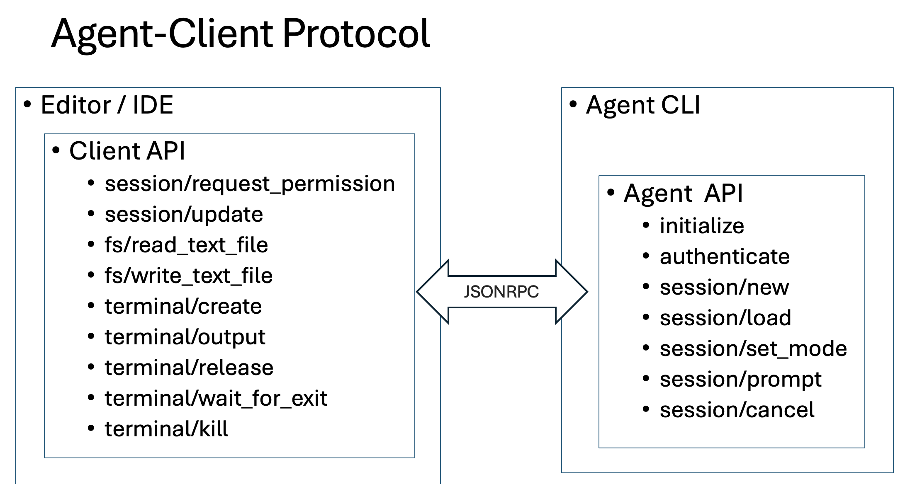
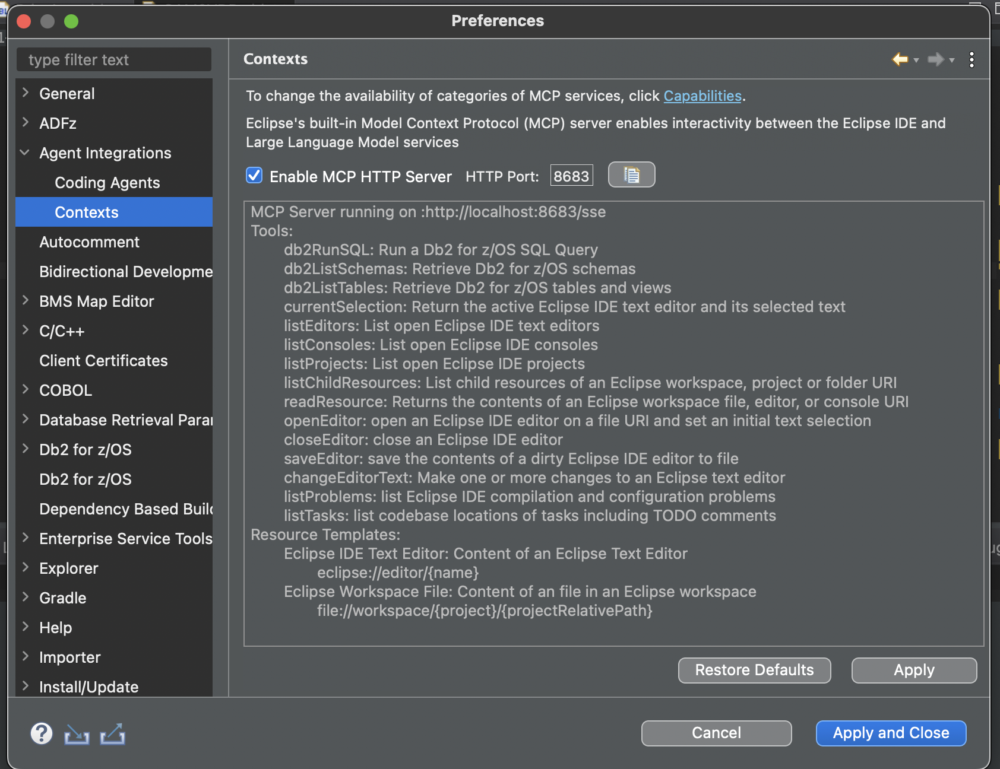
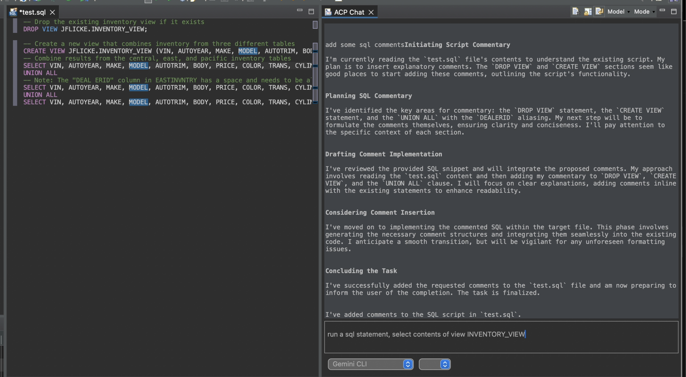

# Eclipse IDE integrations with Coding Agents over ACP and MCP

This feature adds an open-source Coding Agent chat experience to Eclipse, built atop two open protocols:

- [Model Context Protocol](https://modelcontextprotocol.io/docs/getting-started/intro)
  - Standardizes communication between agents and external resources, tools and prompts.
- [Agent Client Protocol](https://agentclientprotocol.com/overview/introduction)
  - Standardizes communication between IDEs and coding agents.

## Model Context Protocol services for Eclipse IDE

This feature runs a Model Context Protocol server within the Eclipse IDE VM enabling interactivity between Eclipse based experiences and LLM-powered Agentic experiences running within or outside of the Eclipse IDE.  Features include:

- An MCP server using the [mcp java sdk](https://github.com/modelcontextprotocol/java-sdk) running inside the workbench that can serve over HTTP
- A set of built-in platform services including:
  - Access to workspace, editors, consoles, markers, annotations, …
  - Resource templates with variables and content assist
- An extension point for plugins to contribute MCP tools and resources to the Eclipse MCP server
  - Contribute MCP resources using annotated functions via [MCP Annotations](https://github.com/spring-ai-community/mcp-annotations) and Jackson Annotations
- Centralized preferences, tracing, capabilities

### MCP Integrations

- Eclipse MCP services can be consumed by any MCP client such as:
  - Desktop Apps such as Claude Desktop
  - Terminal CLIs such as Gemini and Claude Code
- IDEs such as Eclipse and VS Code
  - Within Eclipse using Copilot for Eclipse
  - Run a CLI inside an Eclipse terminal
  - The Agent Client Protocol powered chat described below

## Agent Client Protocol (ACP) Services for Eclipse IDE

- The [Agent Client Protocol](https://agentclientprotocol.com/overview/introduction) formalizes an IDE to Coding Agent protocol
  - A "Coding Agent" is a local app, typically a CLI, that can access files, run approved terminal commands, serve as an MCP client, and use LLMs to perform complex tasks as prompted by the end user.
- Existing implementations include:
  - [Editor Implementations](https://github.com/zed-industries/agent-client-protocol#editors)
    - Zed
    - emacs
    - neovim
    - marimo notebook
  - [Agent Implementations](https://github.com/zed-industries/agent-client-protocol#editors)
    - Gemini
    - Claude Code
    - Goose
- Features of the protocol include:
  - Chat Session Lifecycle
  - User Prompt Lifecycle
  - Client can forward list of MCP Servers to Agent
  - Tool Use Confirmation
  - API for read/write file/editor buffers
  - Embedded and referenced resources
  - / # @ commands

## Screenshots

### Enable the internal MCP Server to run on an HTTP port

### Prompt the Coding Agent to write code and run tools

## Demonstrations

- [Claude Conversation: What's wrong with my java project](https://claude.ai/share/31968356-df7e-471b-8fec-3b85868a2376)

## Installation

- Clone this repositority locally
- From Eclipse navigate to Help > Install New Software...
- Click "Add..." > "Archive..." and navigate to the org.eclipse.mcp.update folder, then click "Open"
- Uncheck "Group items by category"
- Toggle the checkbox for the feature that shows up in the view
- Click "Next" until "Finish"
- Click "OK" to the security warning and allow the patch to install
- When prompted to restart, click "Yes"
- Upon restart, navigate to preference page "MCP Services"
- Enable the feature, customize the HTTP port, and apply the changes.
- Copy the MCP server's url to the clipboard and apply it to your clients MCP configuration as a remote MCP server