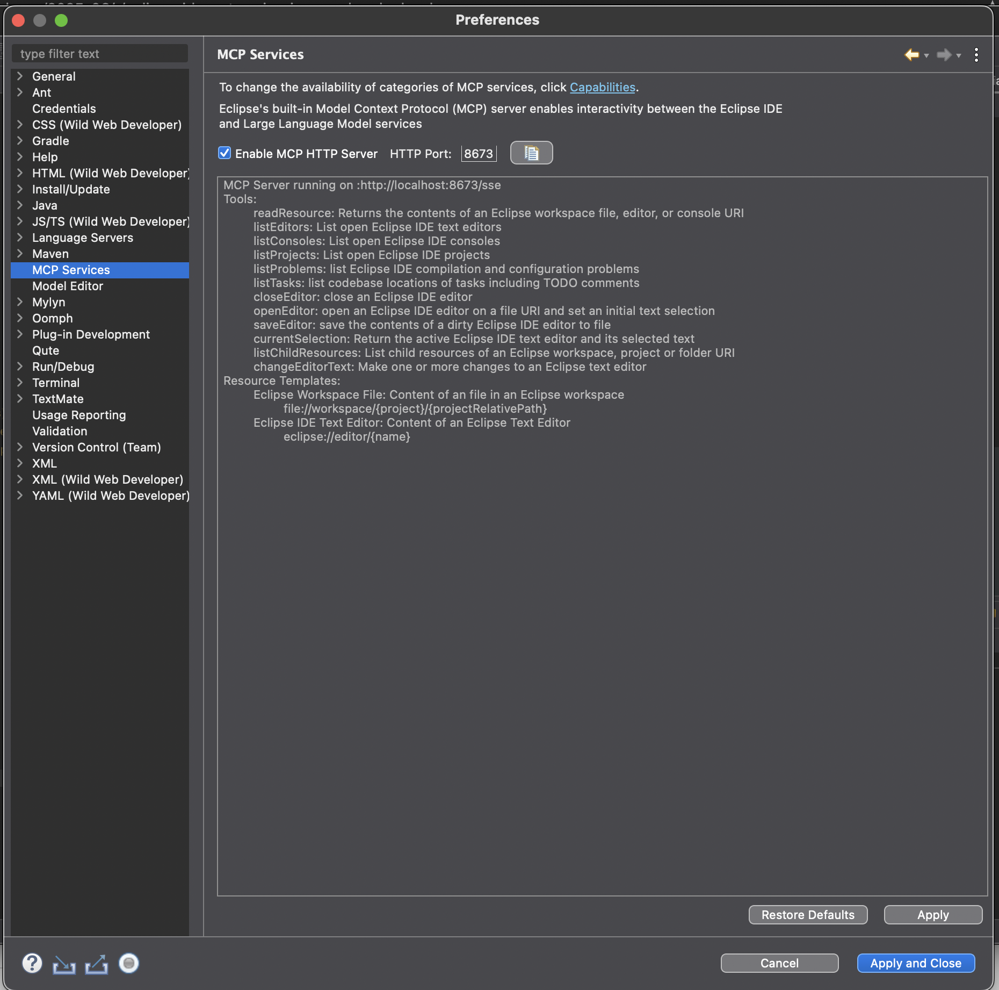
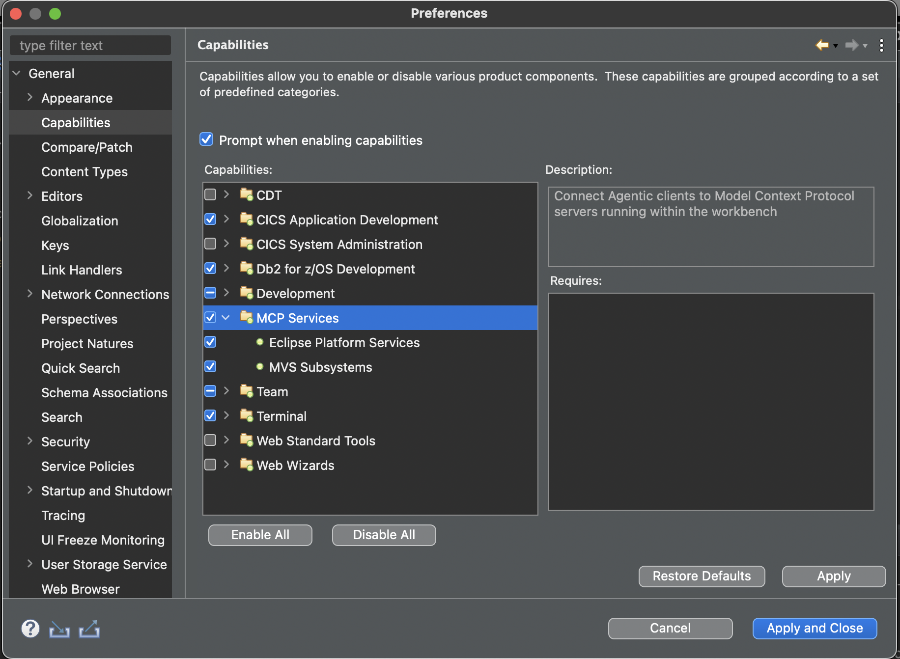

# Model Context Protocol services for Eclipse IDE

This feature runs a Model Context Protocol server within the Eclipse IDE VM enabling interactivity between Eclipse based experiences and LLM-powered Agentic experiences running within or outside of the Eclipse IDE.

Preference page "MCP Services" lets users enable this built-in MCP Server to run on the specified HTTP port.

A suite of built in templates, resources and tools are included with the feature.  These include:

## Features

- Platform:
  - Tools:
    - currentSelection: Return the active Eclipse IDE text editor and its selected text
    - listEditors: List open Eclipse IDE text editors
    - listConsoles: List open Eclipse IDE consoles
    - listProjects: List open Eclipse IDE projects
    - listChildResources: List child resources of an Eclipse workspace, project or folder URI
    - readResource: Returns the contents of an Eclipse workspace file, editor, or console URI
    - openEditor: open an Eclipse IDE editor on a file URI and set an initial text selection
    - closeEditor: close an Eclipse IDE editor
    - saveEditor: save the contents of a dirty Eclipse IDE editor to file
    - changeEditorText: Make one or more changes to an Eclipse text editor
    - listProblems: list Eclipse IDE compilation and configuration problems
    - listTasks: list codebase locations of tasks including TODO comments
  - Resource Templates with Completion Assist:
    - Eclipse IDE Text Editor: Content of an Eclipse Text Editor
      - eclipse://editor/{name}
    - Eclipse Workspace File: Content of an file in an Eclipse workspace
      - file://workspace/{project}/{projectRelativePath}
  - Resource Contributors:
    - Editors: Each open Editor has an associated MCP resource

An extension point is available for other plugins to contribute their own MCP services to the server.

## Screenshots

### Enable the internal MCP Server to run on an HTTP port

### Enable/Disable MCP service contributions from other plugins

## Demonstrations

- [Claude Conversation: What's wrong with my java project](https://claude.ai/share/31968356-df7e-471b-8fec-3b85868a2376)

## Installation

- Clone this repositority locally
- From Eclipse navigate to Help > Install New Software...
- Click "Add..." > "Archive..." and navigate to the org.eclipse.mcp.update folder, then click "Open"
- Uncheck "Group items by category"
- Toggle the checkbox for the feature that shows up in the view
- Click "Next" until "Finish"
- Click "OK" to the security warning and allow the patch to install
- When prompted to restart, click "Yes"
- Upon restart, navigate to preference page "MCP Services"
- Enable the feature, customize the HTTP port, and apply the changes.
- Copy the MCP server's url to the clipboard and apply it to your clients MCP configuration as a remote MCP server